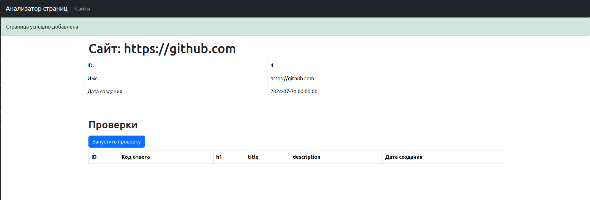
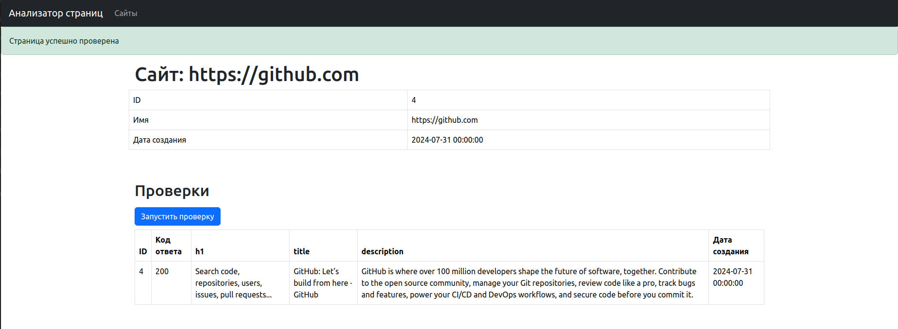
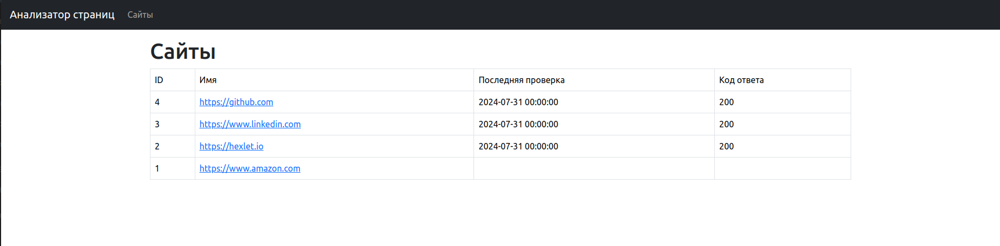
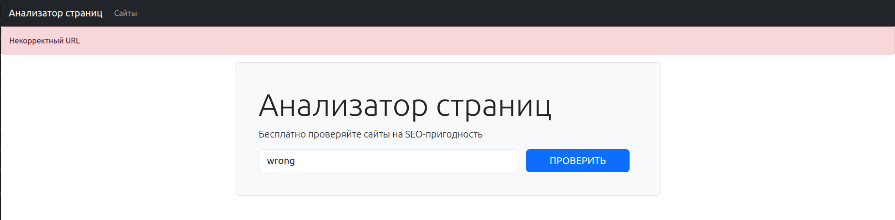

# Page Analyzer
A web application that evaluates websites for SEO optimization.
Simply enter the URL you want to assess, and the tool will analyze key SEO elements such as the header, title, and meta description, providing insights into how search engines will interpret and rank the site.

### Hexlet tests and linter status:

### System requirements:
* python = "^3.10"
* poetry = "^1.4.2"
* PostgreSQL = "^14.12"

### Installation:
1. Create user in PostgreSQL:
    `whoami` -> username
    `sudo -u postgres createuser --createdb <username>`
2. Create database:
    `sudo -u postgres createdb --owner=<username> page_analyzer_db`
3. Rename .env.sample:
    `mv .env.sample .env`
4. Modify contents of .env file:
    user -> created username
    password -> password for created user
5. `make build`

### Run website locally:
`make dev`

### Website:
[Page Analyzer Website](https://page-analyzer-1soa.onrender.com/)

### Usage example:

